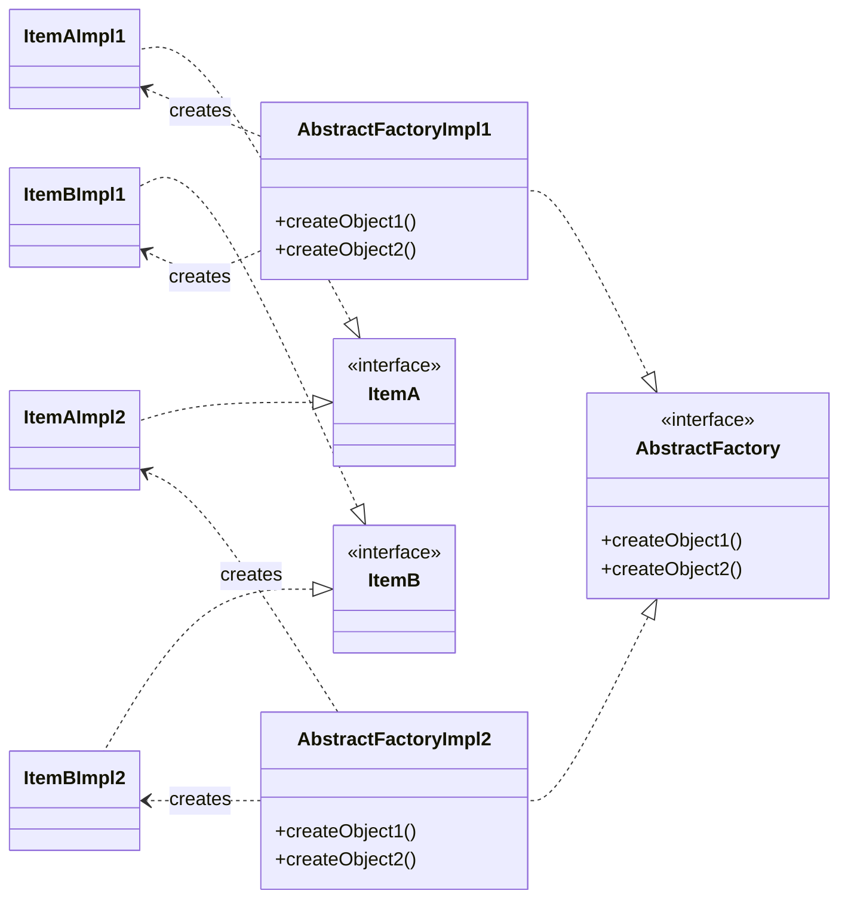

# Patrones de diseño

Los patrones de diseño son estructuras normalizadas (generalmente de POO) creadas con el fin de facilitar y estandarizar determinadas operaciones que son comunes al diseño de software en general (creación de objetos, patrones de comportamiento, patrones de desacople de sistemas...).

## Patrones creacionales

Los patrones creacionales se encargan de abstraer cómo crear una instancia de una clase.

Abstract Factory (GO4)

### Introducción

Provee de una interfaz para crear objetos relacionados o dependientes entre sí, sin especificar sus clases concretas.

### Diagrama

