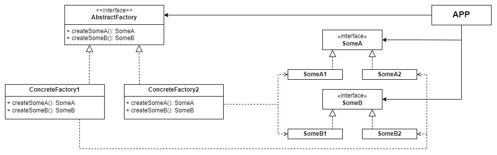

# Patrones de diseño

Los patrones de diseño son estructuras normalizadas (generalmente de POO) creadas con el fin de facilitar y estandarizar determinadas operaciones que son comunes al diseño de software en general (creación de objetos, patrones de comportamiento, patrones de desacople de sistemas...).

## Patrones creacionales

Los patrones creacionales se encargan de abstraer cómo crear una instancia de una clase.

Abstract Factory (GO4)

### Introducción

Provee de una interfaz para crear objetos relacionados o dependientes entre sí, sin especificar sus clases concretas.

### Diagrama

### Partes

- `Abstract Factory`: interfaz que define las operaciones que generan los objetos (Item).
- `ConcreteFactory[0-9]`[^1]: implementaciones de la factoría. Depende de las implementaciones de los items.
- `Item[A-Z]`[^2]: interfaces de las clases a construir.
- `Item[A-Z][0-1]`: implementaciones de las diferentes interfaces de clases a construir. En algunos contextos, existen familias que implementan `Item[A-Z]` de forma coherente entre sí.
- `APP`: aplicación que utilizará las interfaces, agnóstica de las implementaciones.

### Pros

- Aísla clases concretas: como se crean instancias de las clases que maneja la Abstract Factory es desconocido para el que la esté utilizando.
- Es fácil cambiar entre diferentes "familias" de `Items`: cambiar de familias de implementaciones de los mismos items consiste simplemente en cambiar la factoría concreta que se esté utilizando.
- Promueve la consistencia entre `Items`: las diferentes familias trabajan juntas con más cohesión, ya que la implementación de una sola familia es manejada por una factoría concreta.

### Contras

- Ampliar nuevos `Items` es más difícil: para añadir nuevos `Items` a una familia, hay que modificar tanto el contrato como las diferentes implementaciones de la factoría.  
Solucionar este problema no es especialmente complicado: si no se puede acceder a la implementación de la factoría, podemos simplemente extenderla y usar dicha extensión como nueva factoría (aunque no es una solución muy elegante).

> [!NOTE]
> Es común que una implementación de AbstractFactory sea un Singleton.
> Es común que las diferentes implementaciones de los `Items` a su vez implementen un Factory Method u otro patrón de creación.

[^1]: `[0-9]` es intercambiable por cualquier número, haciendo así referencia a algún objeto|clase|interfaz.
[^2]: `[A-Z]` es intercambiable por cualquier número, haciendo así referencia a algún objeto|clase|interfaz.
